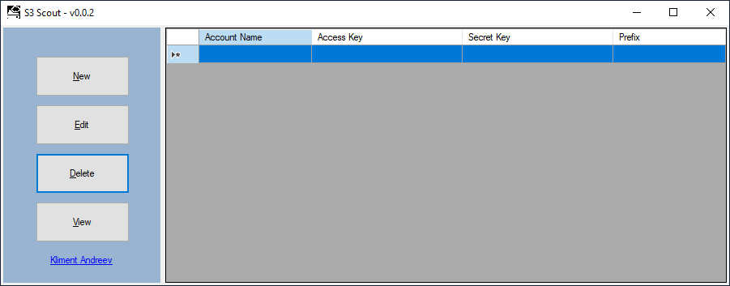
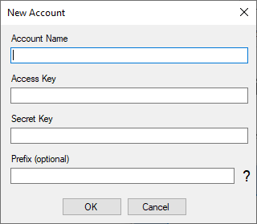
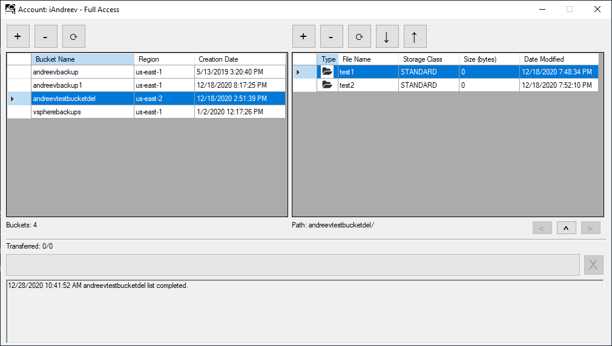

# S3-Scout

S3 Scout is a program made in C# (.NET 4.7.1) for managing S3 objects. It is very similar to S3 Browser and Cyber Duck, but with less options. 
If you want to compile from the source, you'll need the S3 SDK from AWS and the JSON.NET from Newtonsoft. 

**NOTE:** Always use the latest version of the project, there are numerous small bugs fixed.

## Usage

When you start the program for the first time, you'll see the main menu with four options:

* New
* Edit
* Delete
* View

It's very straightforward, use New, Edit and Delete to manage an S3 connection. You'll need the **Access Key** and the **Secret Key**. The **Account Name** is a description for the connection, not the actual AWS account number. The **Prefix** is optional. Use the prefix when you have access only to a single bucket. For example, your admin can give you access only to a bucket named *something*. If you don't enter the name of this bucket in the **Prefix** field, you'll get an error, because most likely you are not allowed to see the other bucket's names.

When you click **View** or double-click an entry in the grid, you'll open the buckets/objects view. 

On the left side are the buckets and on the right side are the objects. If you hover the mouse over the buttons, you'll see a description of their function. The logs are at the bottom.

The accounts are saved in a file **S3 Scout.json** under your **%APPDATA%** folder. 
**NOTE:** The file is encrypted so you can't see any of the access and secret keys for the account.

# Download

You can compile from scratch and make any modifications that you like or you can download the pre-compiled versions from the releases section.

# Issues

If you see any issues, please let me know in the discussion section and steps how to reproduce them.

